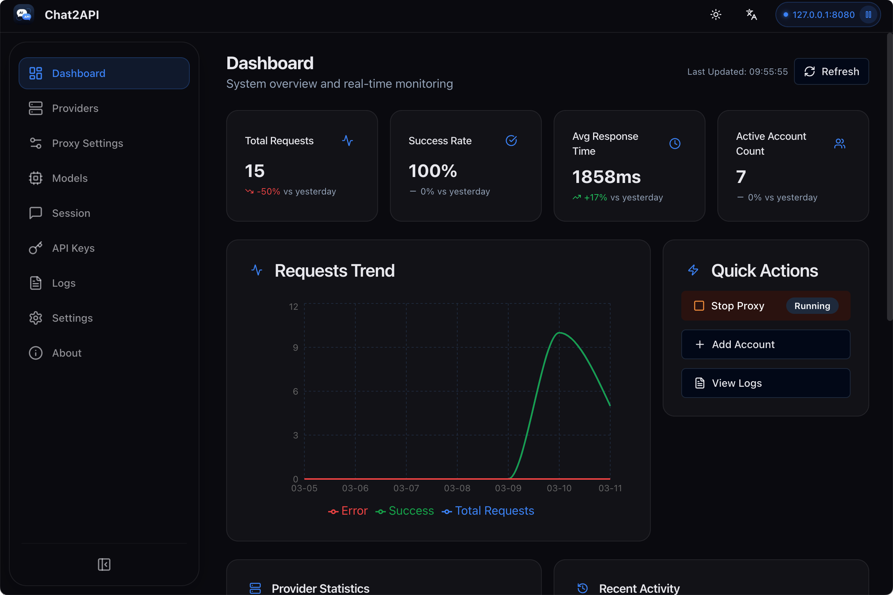
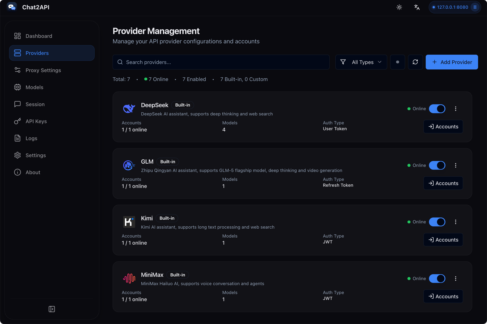
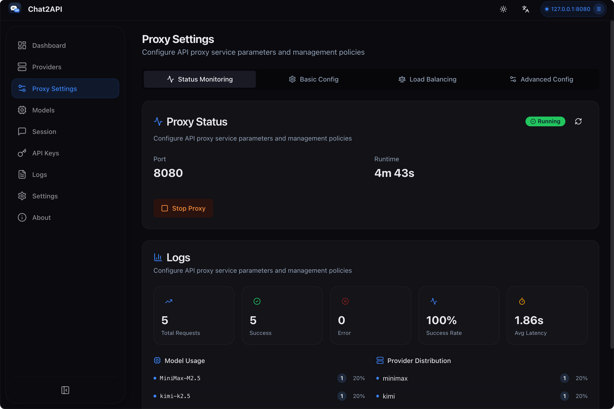
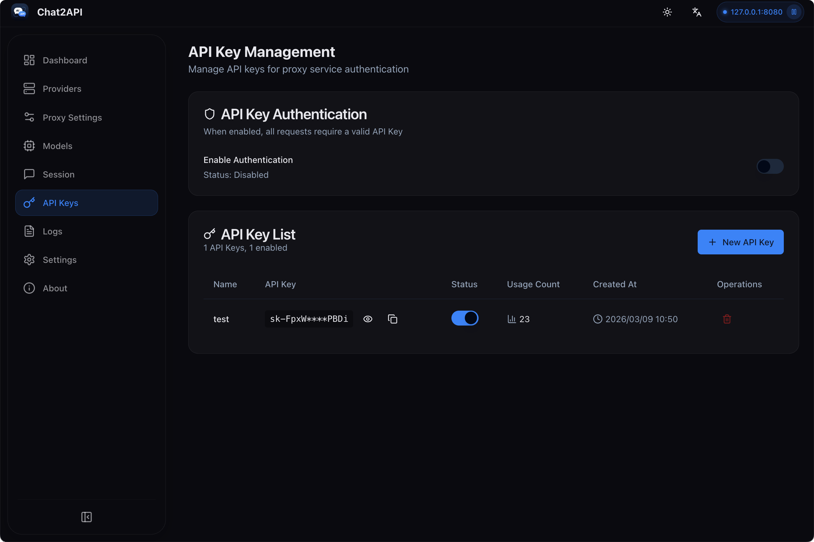
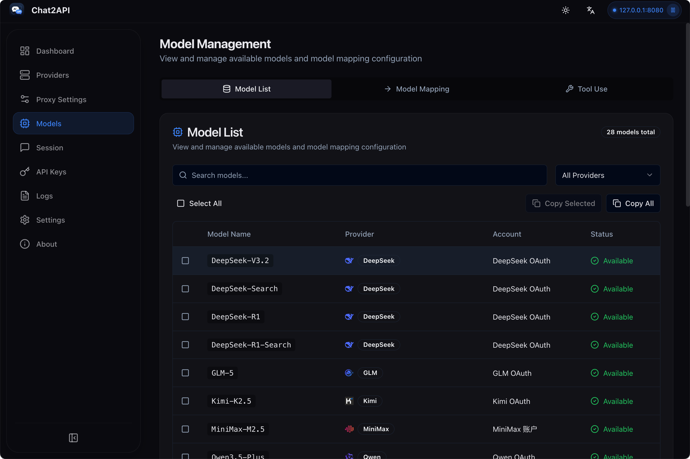
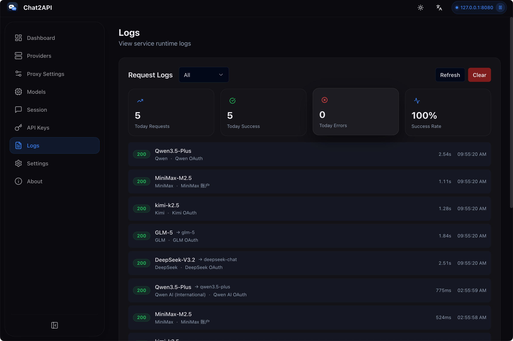
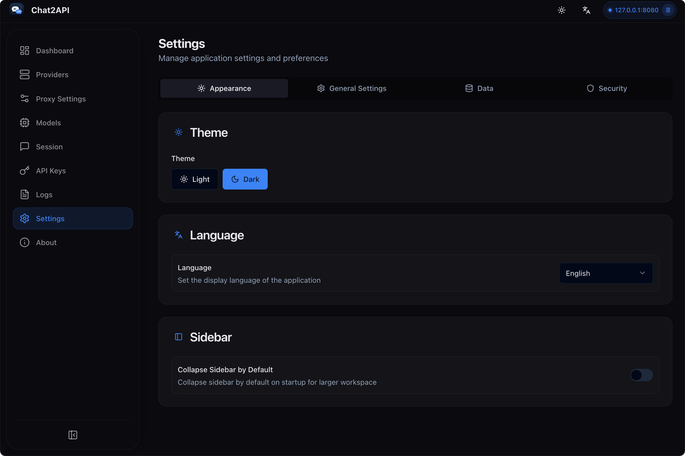
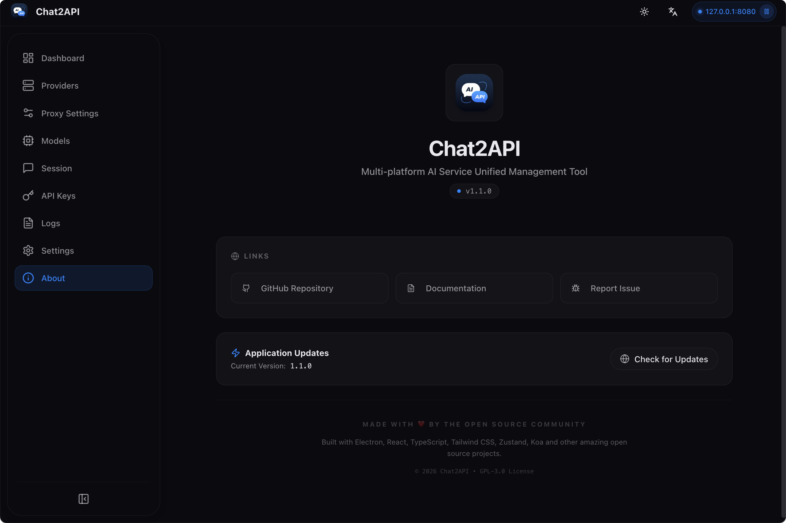

# Chat2API

<p align="center">
  
</p>

<p align="center">
  
  
  <br>
  <a href="https://www.electronjs.org/"></a>
  <a href="https://react.dev/"></a>
  <a href="https://www.typescriptlang.org/"></a>
  
</p>

<p align="center">
  <strong><a href="README_CN.md">中文文档</a></strong>
</p>

<p align="center">
  <strong>Multi-platform AI Service Unified Management Tool</strong>
</p>

<p align="center">
  Chat2API is a native desktop application that provides an <strong>OpenAI-compatible API</strong> for multiple AI service providers. It allows you to use any OpenAI-compatible client with DeepSeek, GLM, Kimi, MiniMax, Qwen, Z.ai and more across <strong>macOS</strong>, <strong>Windows</strong>, and <strong>Linux</strong>.
</p>

## ✨ Features

- OpenAI Compatible API: Provides standard OpenAI-compatible API endpoints for seamless integration
- Multi-Provider Support: Connect DeepSeek, GLM, Kimi, MiniMax, Qwen, Z.ai and more
- Dashboard Monitoring: Real-time request traffic, token usage, and success rates
- API Key Management: Generate and manage keys for your local proxy
- Model Management: View and manage available models from all providers
- Request Logs: Detailed request logging for debugging and analysis
- Proxy Configuration: Flexible proxy settings and routing strategies
- System Tray Integration: Quick access to status from menu bar
- Multilingual: English and Simplified Chinese support
- Modern UI: Clean, responsive interface with dark/light theme support

## 🤖 Supported Providers

| Provider         | Auth Type        | OAuth | Models                                           |
| ---------------- | ---------------- | ----- | ------------------------------------------------ |
| DeepSeek         | User Token       | Yes   | DeepSeek-V3.2                                    |
| GLM              | Refresh Token    | Yes   | GLM-5                                            |
| Kimi             | JWT Token        | Yes   | kimi-k2.5                                        |
| MiniMax          | JWT Token        | Yes   | MiniMax-M2.5                                     |
| Qwen (CN)        | SSO Ticket       | Yes   | Qwen3.5-Plus, Qwen3-Max, Qwen3-Flash, Qwen3-Coder, qwen-max-latest |
| Qwen AI (Global) | JWT Token        | Yes   | Qwen3.5-Plus, Qwen3-Max, Qwen3-VL-Plus, Qwen3-Coder-Plus, Qwen-Plus, Qwen-Turbo |
| Z.ai             | JWT Token        | Yes   | GLM-5, GLM-4.7, GLM-4.6V, GLM-4.6              |

## 📥 Installation

### Download

Download the latest release from [GitHub Releases](https://github.com/xiaoY233/Chat2API/releases):

| Platform              | Download                              |
| --------------------- | ------------------------------------- |
| macOS (Apple Silicon) | `Chat2API-x.x.x-arm64.dmg`            |
| macOS (Intel)         | `Chat2API-x.x.x-x64.dmg`              |
| Windows               | `Chat2API-x.x.x-x64-setup.exe`        |
| Linux                 | `Chat2API-x.x.x-x64.AppImage` or `.deb` |

### Build from Source

**Requirements:**

- Node.js 18+
- npm
- Git

```bash
# Clone the repository
git clone https://github.com/xiaoY233/Chat2API.git
cd Chat2API

# Install dependencies
npm install

# Start development server
npx electron-vite dev 2>&1
```

### Build for Production

```bash
npm run build              # Build the application
npm run build:mac          # Build for macOS (dmg, zip)
npm run build:win          # Build for Windows (nsis)
npm run build:linux        # Build for Linux (AppImage, deb)
npm run build:all          # Build for all platforms
```

## 📖 Usage

### 1. Start the Application

Launch Chat2API and configure your preferred settings.

### 2. Add Providers

Go to **Providers** tab → Add a provider → Enter API key or authenticate via OAuth.

### 3. Configure Proxy

Go to **Proxy Settings** tab → Configure port and routing strategy → Start the proxy server.

### 4. Manage API Keys

Go to **API Keys** tab → Generate keys for accessing your local proxy.

### 5. Monitor Usage

- **Dashboard**: Overall health and traffic statistics
- **Models**: View available models from all providers
- **Logs**: Request logs for debugging

## 📸 Screenshots

| Dashboard                                    | Providers                                    |
| -------------------------------------------- | -------------------------------------------- |
|  |  |

| Proxy Settings                                    | API Keys                                    |
| ------------------------------------------------- | ------------------------------------------- |
|               |   |

| Models                                    | Logs                                    |
| ----------------------------------------- | --------------------------------------- |
|     |       |

| Settings                                    | About                                    |
| ------------------------------------------- | ---------------------------------------- |
|   |     |

## ⚙️ Settings

- **Port**: Change the proxy listening port (default: 8080)
- **Routing Strategy**: Round Robin or Fill First
- **Auto-start**: Launch proxy automatically on app startup
- **Theme**: Light, Dark, or System preference
- **Language**: English or Simplified Chinese

## 🏗️ Architecture

```
Chat2API/
├── src/
│   ├── main/                    # Electron main process
│   │   ├── index.ts            # App entry point
│   │   ├── tray.ts             # System tray integration
│   │   ├── proxy/              # Proxy server management
│   │   ├── ipc/                # IPC handlers
│   │   └── utils/              # Utilities
│   ├── preload/                # Context bridge
│   └── renderer/               # React frontend
│       ├── components/         # UI components
│       ├── pages/              # Page components
│       ├── stores/             # Zustand state
│       └── hooks/              # Custom hooks
├── build/                      # Build resources
└── scripts/                    # Build scripts
```

## 🔧 Tech Stack

| Component | Technology            |
| --------- | --------------------- |
| Framework | Electron 33+          |
| Frontend  | React 18 + TypeScript |
| Styling   | Tailwind CSS          |
| State     | Zustand               |
| Build     | Vite + electron-vite  |
| Packaging | electron-builder      |
| Server    | Koa                   |

## 📁 Data Storage

Application data is stored in `~/.chat2api/` directory:

- `config.json` - Application configuration
- `providers.json` - Provider settings
- `accounts.json` - Account credentials (encrypted)
- `logs/` - Request logs

## ❓ FAQ

### macOS: "App is damaged and can't be opened"

Due to macOS security mechanisms, apps downloaded outside the App Store may trigger this warning. Run the following command to fix it:

```bash
sudo xattr -rd com.apple.quarantine "/Applications/Chat2API.app"
```

### How to update?

Check for updates in the **About** page, or download the latest version from [GitHub Releases](https://github.com/xiaoY233/Chat2API/releases).

## 🤝 Contributing

1. Fork the project
2. Create a feature branch (`git checkout -b feature/amazing-feature`)
3. Commit changes (`git commit -m 'Add amazing feature'`)
4. Push to branch (`git push origin feature/amazing-feature`)
5. Open a Pull Request

## 📄 License

GNU General Public License v3.0. See [LICENSE](LICENSE) for details.

This means:
- ✅ Free to use, modify, and distribute
- ✅ Derivative works must be open-sourced under the same license
- ✅ Must preserve original copyright notices

## 🙏 Acknowledgments

- [Electron](https://www.electronjs.org/) - Cross-platform framework
- [React](https://react.dev/) - UI framework
- [TypeScript](https://www.typescriptlang.org/) - Type-safe JavaScript
- [Tailwind CSS](https://tailwindcss.com/) - CSS framework
- [Zustand](https://zustand-demo.pmnd.rs/) - State management
- [Koa](https://koajs.com/) - HTTP server
