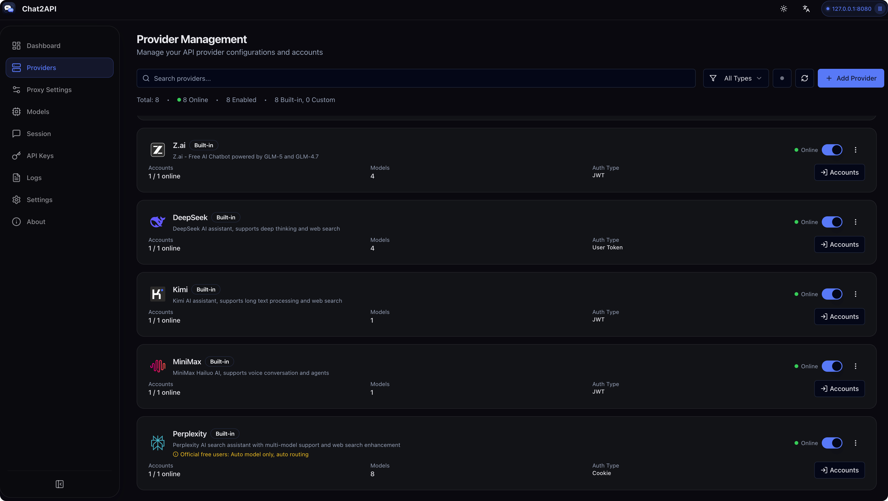
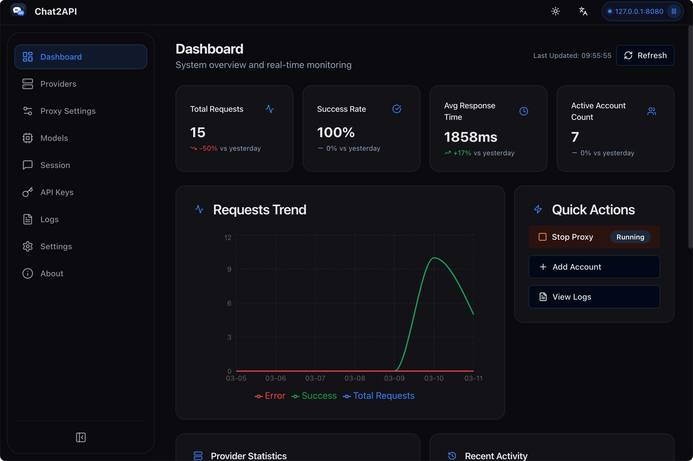
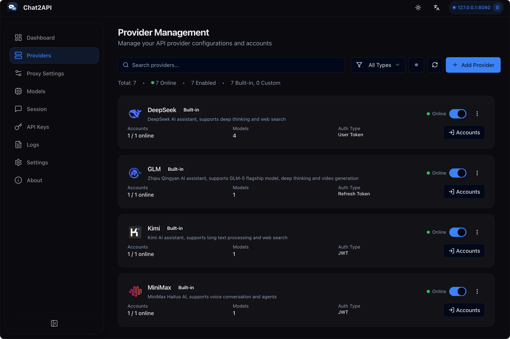
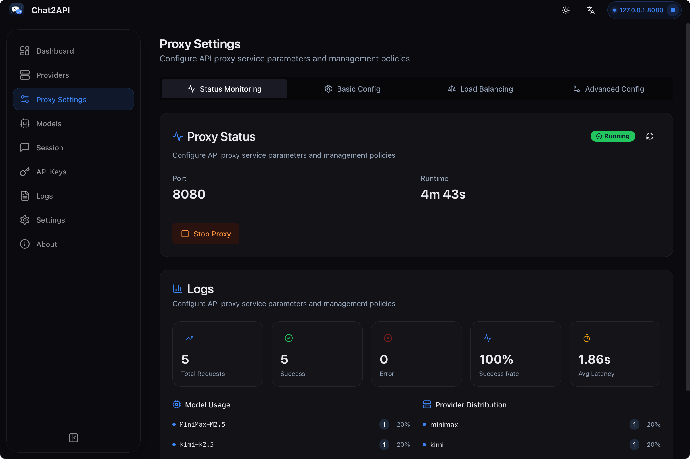
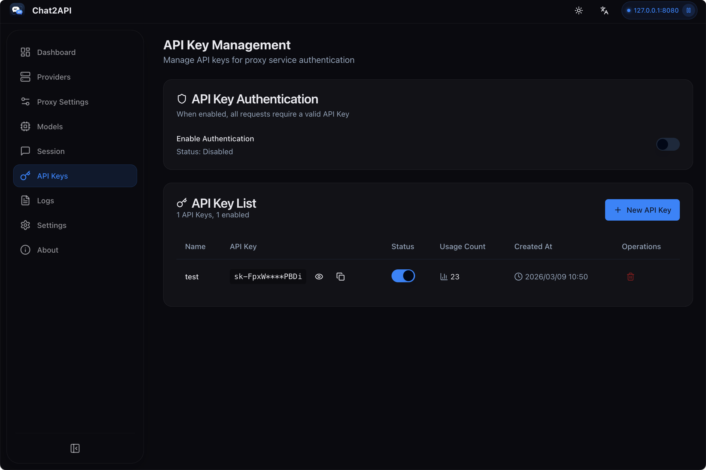
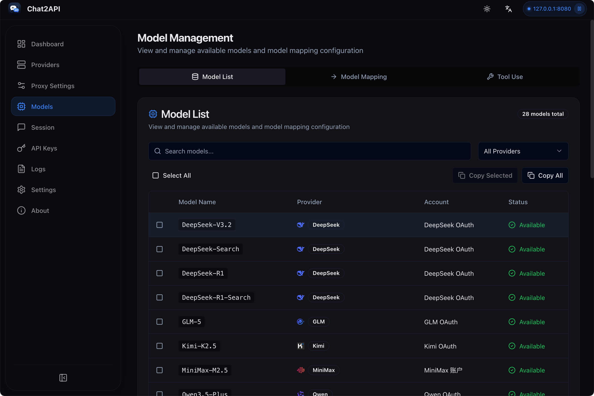
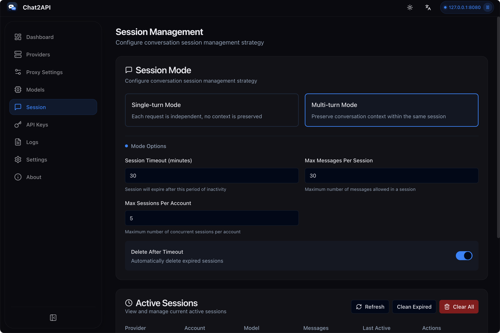

# 🚀 服务器一键部署与更新

> 适用于 Ubuntu / Debian 无桌面服务器。安装脚本会在 SSH 中交互输入部署端口和项目原生的 Management Secret（留空可自动生成），自动部署完整 Py 版 `/admin/` WebUI；API Key 单独生成并保存为仅 root 可读文件。更新前会备份账户、配置、凭据和运行数据。

**部署我的 Fork 版**

```bash
bash <(curl -fsSL https://raw.githubusercontent.com/qingan123/Chat2API/main/scripts/install-fork.sh)
```

**部署 Py 上游对照版**

```bash
bash <(curl -fsSL https://raw.githubusercontent.com/qingan123/Chat2API/main/scripts/install-official.sh)
```

**更新已部署实例（自动发现 Fork版与 Py 上游版多实例）**

```bash
bash <(curl -fsSL https://raw.githubusercontent.com/qingan123/Chat2API/main/scripts/update.sh)
```

默认目录：Fork版 `/opt/chat2api-<端口>`，Py 上游版 `/opt/chat2api-py-upstream-<端口>`。后台地址为 `http://公网IP:<端口>/admin/`，OpenAI Base URL 为 `http://公网IP:<端口>/v1`。部署成功不等于云安全组、防火墙、NAT 或反向代理已经放行端口。

后续对比 `pyf-feifei/Chat2API` 与官方 `xiaoY233/Chat2API`、同步上游、解决冲突、测试和回滚，请阅读 [`docs/MAINTENANCE_CN.md`](docs/MAINTENANCE_CN.md)。

---

# Chat2API

<p align="center">
  
</p>

<p align="center">
  <a href="https://github.com/pyf-feifei/Chat2API/releases"></a>
  <a href="LICENSE"></a>
  <a href="https://www.electronjs.org/"></a>
  <a href="https://react.dev/"></a>
  <a href="https://www.typescriptlang.org/"></a>
  
</p>

<p align="center">
  <strong><a href="README_CN.md">中文</a> | <a href="https://chat2api-doc.vercel.app/">Website</a> | <a href="https://chat2api-doc.vercel.app/docs">Documentation</a></strong>
</p>

Chat2API is a cross-platform desktop app and headless server that turns web-based AI provider accounts into one local, OpenAI-compatible gateway. Configure providers and accounts once, then connect the same endpoint to OpenAI SDKs, coding agents, desktop clients, or internal tools.



## Highlights

- **OpenAI-compatible gateway**: Chat Completions at `/v1/chat/completions`, Responses at `/v1/responses`, legacy Completions at `/v1/completions`, model listing, streaming SSE, API-key authentication, and multimodal message handling. Gemini-compatible generation and file routes are also available under `/v1beta`.
- **Provider and account management**: Add multiple accounts per provider, validate credentials, map client model names, pin a model to a provider or account, and choose round-robin, fill-first, or failover routing.
- **Tool and reasoning compatibility**: Function/custom tool calls, tool-result continuations, reasoning content, web search, deep research, and provider-specific thinking modes are normalized where the upstream service supports them.
- **Long-running request controls**: Context compaction, request and stream deadlines, queue admission, keep-alives, bounded retries, and Qwen session/response recovery.
- **Desktop and server deployments**: Use the Electron UI on macOS, Windows, or Linux, or run the Koa proxy and browser admin UI in Docker without Electron.
- **Operations UI**: Dashboard metrics, request logs, model synchronization, API keys, proxy settings, themes, system tray access, and English/Simplified Chinese localization.
- **Client bridges**: [Codex CLI Responses compatibility](docs/codex.md) and an optional [Anthropic-compatible LiteLLM deployment](docs/litellm.md).

## Supported providers

The built-in catalogue currently includes:

| Provider | Authentication | Built-in models |
| --- | --- | --- |
| DeepSeek | User token | `deepseek-v4-flash`, `deepseek-v4-pro` |
| GLM | Refresh token | `GLM-5.1` |
| Kimi | JWT / web token | `Kimi-K2.6`, `Kimi-K3` |
| MiniMax | JWT | `MiniMax-M2.7` |
| Mimo | Browser cookies | `MiMo-V2.5-Pro`, `MiMo-V2.5`, `MiMo-V2-Flash` |
| Perplexity | Session cookie | `Auto` |
| Qwen (China) | SSO ticket | `Qwen3.6`, `Qwen3.7-Max`, `Qwen3.5-Flash`, `Qwen3-Max`, `Qwen3-Max-Thinking-Preview`, `Qwen3-Coder` |
| Qwen AI (International) | JWT, optional cookies and login credentials | `Qwen3.8-Max`, `Qwen3.8-Max_Fast`, `Qwen3.8-Max_Auto`, `Qwen3.8-Max_Thinking`, `Qwen3.7-Plus`, `Qwen3.7-Max` |
| Z.ai | JWT | `GLM-5.1`, `GLM-5-Turbo`, `GLM-5V-Turbo`, `GLM-5`, `GLM-4.7` |

Provider availability and model names follow the upstream web applications and may change. See the [provider notes](docs/providers/README.md) for credential and model-mapping details.

## Install

### Desktop release

Download a platform package from [GitHub Releases](https://github.com/xiaoY233/Chat2API/releases) when a release is available. The source mirror is [pyf-feifei/Chat2API](https://github.com/pyf-feifei/Chat2API).

| Platform | Package |
| --- | --- |
| macOS Apple Silicon | `Chat2API-<version>-mac-arm64.dmg` |
| macOS Intel | `Chat2API-<version>-mac-x64.dmg` |
| Windows | `Chat2API-<version>-x64-setup.exe` or portable build |
| Linux | `Chat2API-<version>-x64.AppImage`, `.deb`, or `.tar.gz` |

### Build from source

Requirements: Node.js 18+, npm, and Git. The Docker image uses Node.js 22.

```bash
git clone https://github.com/pyf-feifei/Chat2API.git
cd Chat2API
npm install
npm run dev:win       # Windows
npm run dev           # macOS/Linux
```

Production packages can be built with:

```bash
npm run build
npm run build:mac
npm run build:win
npm run build:linux
npm run build:all
```

### Docker server

The server image runs the Koa proxy and browser admin UI, stores state in `/data`, and listens on port `8080` by default:

```bash
docker build -t chat2api:server .
docker run -d --name chat2api \
  -p 8080:8080 \
  -v chat2api-data:/data \
  -e CHAT2API_HOST=0.0.0.0 \
  -e CHAT2API_PORT=8080 \
  -e CHAT2API_ENABLE_MANAGEMENT_API=true \
  -e CHAT2API_MANAGEMENT_SECRET=change-me \
  chat2api:server
```

Open `http://localhost:8080/admin/` and use the management secret to sign in. The complete [Docker guide](docs/docker.md) covers Compose, browser-assisted account import, storage encryption, Qwen session repair, and deployment tuning.

## Quick start

1. Launch Chat2API, or start the Docker server.
2. Open **Providers**, add a built-in provider, and enter its web credential. Credentials are stored locally; never commit them to source control.
3. Open **Proxy Settings**, choose a port and routing strategy, then start the proxy.
4. Point an OpenAI-compatible client at `http://127.0.0.1:8080/v1`.

Example with the OpenAI Python SDK:

```python
from openai import OpenAI

client = OpenAI(
    api_key="your-chat2api-key",
    base_url="http://127.0.0.1:8080/v1",
)

response = client.chat.completions.create(
    model="deepseek-v4-flash",
    messages=[{"role": "user", "content": "Hello from Chat2API"}],
)

print(response.choices[0].message.content)
```

For Codex CLI, use the Responses endpoint and the configuration in [docs/codex.md](docs/codex.md). For Claude or other Anthropic clients, see the [LiteLLM guide](docs/litellm.md).

## Screenshots

| Dashboard | Providers |
| --- | --- |
|  |  |

| Proxy settings | API keys |
| --- | --- |
|  |  |

| Models | Sessions |
| --- | --- |
|  |  |

## Configuration and data

Desktop data is stored in `~/.chat2api/`; Docker data is stored in the mounted `/data` volume.

| Path | Contents |
| --- | --- |
| `config.json` | Proxy, UI, and application settings |
| `providers.json` | Provider definitions and model mappings |
| `accounts.json` | Account credentials and account state |
| `logs/` | Request logs |

The server supports environment variables for host/port, management API, API keys, storage encryption, load balancing, request deadlines, and provider-specific controls. Start with the examples in [docs/docker.md](docs/docker.md).

## Contributing

Issues, provider updates, tests, and documentation improvements are welcome. Please read the existing provider notes and open an issue before large adapter changes.

```bash
npm install
npm run build
npm run test:server-compat
```

## License

Chat2API is released under the [GNU General Public License v3.0](LICENSE).

## Acknowledgements

[Electron](https://www.electronjs.org/), [React](https://react.dev/), [TypeScript](https://www.typescriptlang.org/), [Tailwind CSS](https://tailwindcss.com/), [Zustand](https://zustand-demo.pmnd.rs/), and [Koa](https://koajs.com/).
